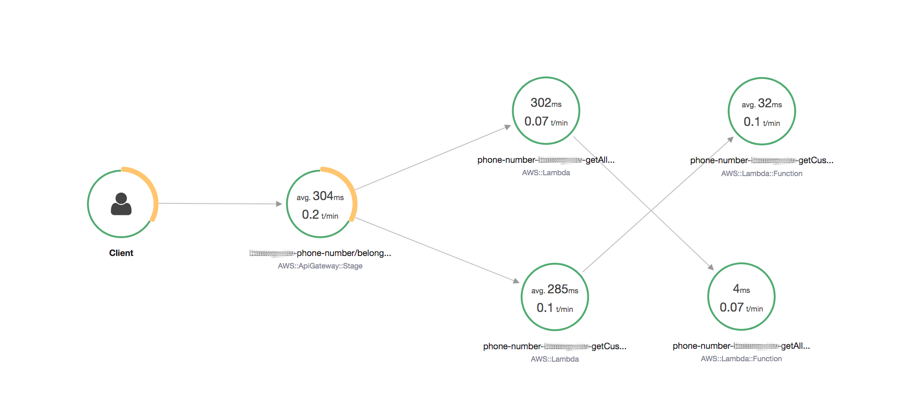

# Serverless challenge

## Notable features

 * Tracing enabled
 * Metrics logs for extraction as custom metrics
 * Externalised input validation

## Development

 * Runtime NodeJS v12 with `npm` package manager
 * Setup `npm install`
 * Apply linting rules `npm run lint`
 * Run tests `npm run test`
 * Code coverage `npm run test:coverage`
 * Note : backing store is mocked, using random data

## Deployment

### AWS setup

Ensure your `~/.aws/credentials` file is set up. Example,

```
[default]
source_profile           = XXX-sandbox

[XXX-sandbox]
aws_access_key_id        = XXXXXXXXXXXXXXXXXXXX
aws_secret_access_key    = XXXXXXXXXXXXXXXXXXXXXXXXXXXXXXXXXXXXXXXX
```

### Run

```
AWS_PROFILE=XXX-sandbox npm run deploy
```

This command will use the version of `sls` that is installed in `node_modules`, not the system-wide version.

Output sample,

```
Serverless: Packaging service...
Serverless: Excluding development dependencies...
Serverless: Uploading CloudFormation file to S3...
Serverless: Uploading artifacts...
Serverless: Uploading service phone-number.zip file to S3 (6.1 MB)...
[...]
endpoints:
  GET - https://3333co0ss1.execute-api.ap-southeast-2.amazonaws.com/dev/phonenumbers/all
  POST - https://3333co0ss1.execute-api.ap-southeast-2.amazonaws.com/dev/phonenumbers/customer
  POST - https://3333co0ss1.execute-api.ap-southeast-2.amazonaws.com/dev/phonenumbers/activate
```

### Manual testing

```
CUSTOMER_PHONE_NUMBERS=https://3333co0ss1.execute-api.ap-southeast-2.amazonaws.com/dev/phonenumbers/customer

# Invalid data
curl \
  -X POST \
  -H "Content-Type: application/json" \
  --data '{"customerId": "asd"}' \
  $CUSTOMER_PHONE_NUMBERS

# Valid data
curl -X POST \
  -H "Content-Type: application/json" \
  --data '{"customerId": "affd9ea8-d9b5-430c-a861-546f7143cf5d"}'\
  $CUSTOMER_PHONE_NUMBERS
```

## Observability

### Tracing

These traces are for 3 API calls,

 1. Valid `getAllPhoneNumbers` call
 2. Valid `getCustomerPhoneNumbers` call
 3. Invalid `getCustomerPhoneNumbers` call

This gives us 33% errors (HTTP 400 range) with 0% faults (HTTP 500 range).




## Design choices

### Data format

 * Phone numbers are 10 digits
 * Users are identified by v4 UUID strings

### HTTP verbs

 * Requests that take parameters use POST

This allows all incoming requests to be validated using the same code instead of using different extract/parse/validate paths for `event.queryStringParameters` and `event.body`. All parameters are required to be valid JSON and validation uses JSON-schema.

### Input validation

 * All parameters are specified in JSON-schema.
 
This allows us to externalise input validation and simplifies the code of the actual API function. On AWS we can also use the definitions to push the input validation further upstream to API-Gateway itself. This means that function calls with invalid parameters do not hit the Lambda service and no Lambda costs are incurred for invalid calls.


 
## Language selection notes

 * NodeJS is a mature and well-supported AWS Lambda runtime
 * Typescript has compile-time advantages, but the runtime code is transformed, which makes debugging harder
 * There is plenty of JavaScript knowledge in the market
 * Onboarding developers with a Javascript profile to Lambda is relatively straightforward if the platform work is separated out with a framework

